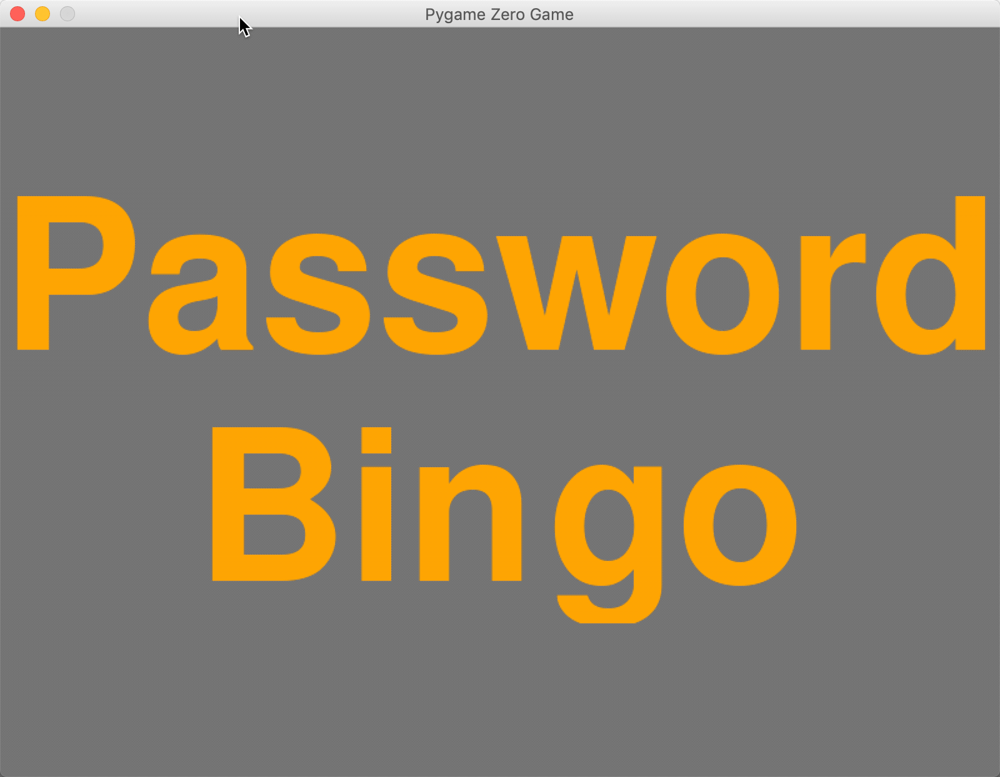

# Popular Password Bingo

A bingo caller app that displays the most commonly used passwords in 2019.
Click to show a random password.



Try out the [online version][5]

The passwords are a list of the [most common passwords in 2019][1] as compiled by SplashData. The list was made by evaluating over five million leaked passwords. Play along using this [online bingo card][2].


### Prerequisites

You'll need Pygame Zero:

```sh
pip install pgzero
```


### Built with

* [Pygame Zero](https://pygame-zero.readthedocs.io/en/stable/)
* [Atom](https://atom.io/)
* [Gifox](https://gifox.io/)

### Acknowledgements

* List of passwords from [SplashData][3]
* [Bingo Baker][4]


[1]: https://metro.co.uk/2019/12/19/10-worst-passwords-2019-revealed-nothing-changed-11932281/
[2]: https://bingobaker.com/play/2767617
[3]: https://www.splashdata.com/
[4]: https://bingobaker.com/
[5]: https://trinket.io/library/trinkets/3e037c3c17
